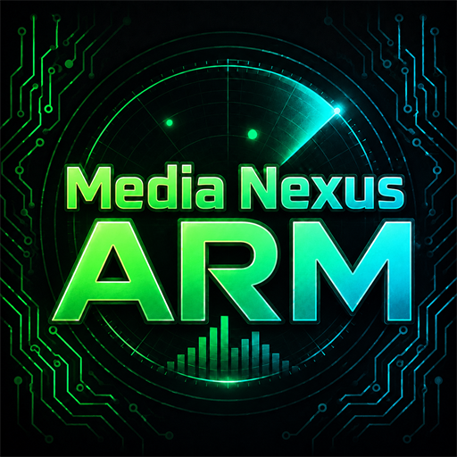

# Media Nexus ARM

<p align="center">
  
</p>

Media Nexus ARM is a Windows automatic ripping machine for movies, TV series, music CDs, and audiobooks across multiple optical drives.

## Current v0.2 features

- Remembers any number of user-selected optical drives; tested around a seven-drive layout
- Requires an explicit per-drive Movie / TV Series / Music / Book selection before starting
- Defaults every drive to None and resets it to None after disc removal
- Selects a probable main feature for movies instead of copying every title
- Clusters similarly timed episode titles while excluding likely Play All and short extras
- Shows a pre-rip title confirmation table with runtime, size, chapters, playlist, segment map, and composite warnings
- Detects longer composite Blu-ray playlists that contain a coherent feature playlist (including the tested Deja Vu structure)
- Offers safe post-rip Plex naming for movies and sequential TV episodes
- Can retrieve TV show identity, year, and episode names from TVMaze without an account or API key
- Runs independent MakeMKV and audio jobs concurrently
- Throttles UI rendering and avoids polling busy drives to remain responsive during multi-disc sessions
- Downloads and validates the official portable fre:ac 1.1.7 engine on first audio rip
- Rips audio CDs to lossless ALAC `.m4a`; iTunes is no longer used
- Calculates MusicBrainz Disc IDs directly from the physical CD TOC
- Retrieves MusicBrainz release/track metadata and Cover Art Archive artwork
- Embeds tags and artwork, then organizes music as `Music\Artist\Album (Year)\01 - Track.m4a`
- Preserves successful audio under `Pending Metadata` when identification is unavailable
- Shows independent status and progress per drive and ejects every completed/failed disc
- Produces per-job logs and retains recoverable staging files when final processing fails

## Requirements

- Windows 10 or Windows 11, x64
- [MakeMKV](https://www.makemkv.com/) installed in its standard Program Files location
- One or more optical drives
- Internet access for the first music rip and music metadata/artwork

No iTunes, MusicBrainz Picard, fre:ac installation, FFmpeg, Python, or API key is required. Media Nexus ARM manages a private portable fre:ac copy under `%LOCALAPPDATA%\Media Nexus ARM\Data\Tools\freac`.

## Download and run

1. Download `Media-Nexus-ARM.exe` from this repository or the latest release.
2. Install MakeMKV.
3. Run `Media-Nexus-ARM.exe`.
4. Select the optical drives to manage and an output folder.
5. Insert a disc, then select Movie, TV Series, Music, or Book for that drive.
6. Insert discs.

The application is portable and does not create an installer or automatic-start entry.

## Output layout

```text
<selected output>/
|-- Movies/
|-- TV Series/
|-- Music/
|-- Audiobooks/
|-- Pending Metadata/
|-- Staging/
`-- Logs/
```

MusicBrainz or artwork failure does not discard a successful extraction. Unidentified albums are retained in `Pending Metadata`; incomplete post-processing remains in `Staging` for recovery.

## Video title selection

After the user selects Movie or TV Series, Media Nexus ARM uses MakeMKV's title information without FFmpeg/ffprobe. Movie mode selects the longest substantial title. TV Series mode selects the similarly timed probable episode cluster while excluding short extras and a combined Play All title.

These are conservative heuristics. Unusually authored or obfuscated discs can still require manual selection.

## Settings and privacy

Drive selections, output location, and layout preferences are stored for the current Windows user under `HKEY_CURRENT_USER\Software\DiscRipper`.

The executable contains no user-specific paths, credentials, tokens, telemetry, or automatic reporting. Network access is limited to downloading the managed fre:ac package and requesting MusicBrainz/Cover Art Archive data during music processing. MakeMKV and fre:ac remain subject to their own licenses and behavior.

## Build from source

Run:

```powershell
powershell -ExecutionPolicy Bypass -File .\build.ps1
```

The result is `dist\Media-Nexus-ARM.exe`. TagLibSharp is embedded in the executable by the build.

## Video naming

After ripping, Movie mode can create `Movies\Title (Year)\Title (Year).mkv`. TV mode asks for the show, season, and first episode, can fill episode names from TVMaze, and creates `TV Shows\Show (Year)\Season 03\Show (Year) - S03E05 - Episode.mkv`. Choosing **Keep Original Names** preserves the raw MakeMKV folder.

The downloadable local IMDb search database remains a roadmap item. Movie title and year confirmation is currently user-assisted; Media Nexus does not silently invent a movie match or place database IDs in visible names.

## Third-party components

- [fre:ac](https://www.freac.org/) is downloaded from its official release and managed separately at runtime.
- [TagLibSharp 2.3.0](https://github.com/mono/taglib-sharp) is embedded for M4A metadata and is licensed under LGPL-2.1-only. See `THIRD-PARTY-NOTICES.md`.

Only rip media you own or are legally authorized to copy. Laws and license terms vary by location.
